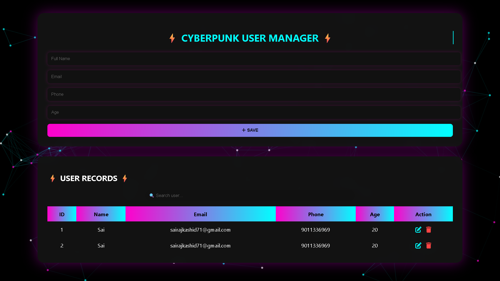

# 🚀 Cyberpunk CRUD System

  

A fully functional PHP + MySQL CRUD application with an advanced dark neon UI.

## 🔥 Features

- ✅ Create User
- ✅ Read Users (Dynamic Table)
- ✅ Update User
- ✅ Delete User
- ✅ Search Functionality
- ✅ Dark Neon Cyberpunk UI
- ✅ Animations & Effects
- ✅ Particles Background
- ✅ Neon Cursor Trail
- ✅ Typing Animation Heading

---

## 🛠️ Tech Stack

- PHP
- MySQL
- XAMPP
- HTML5
- CSS3 (Advanced Neon Styling)
- JavaScript
- FontAwesome
- Particles.js

---

## 🗄️ Database Structure

Database Name: `crud_db`

Table Name: `users`

| Column | Type |
|--------|------|
| id     | INT (AUTO_INCREMENT, PRIMARY KEY) |
| name   | VARCHAR(100) |
| email  | VARCHAR(100) |
| phone  | VARCHAR(15) |
| age    | INT |

---

## 💻 Installation Steps

1. Install XAMPP
2. Start Apache & MySQL
3. Create database `crud_db`
4. Import/Create `users` table
5. Place project in:
   C:\xampp\htdocs\crud

6. Open in browser:
   http://localhost/crud
  ## 📸 Project Screenshot

---

## 👨‍💻 Developed By

**Sairaj Kashid**
